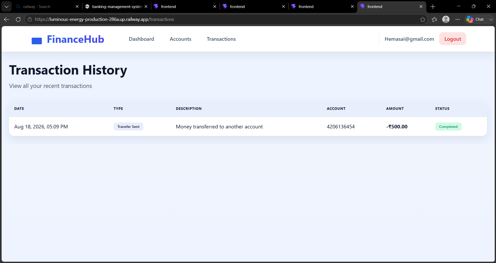
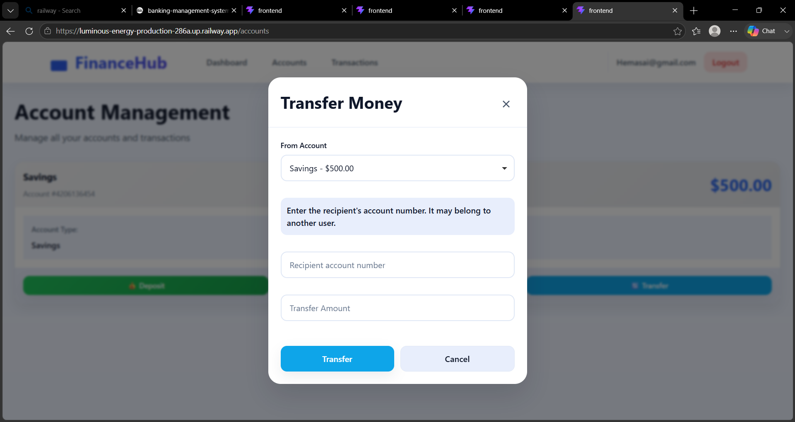
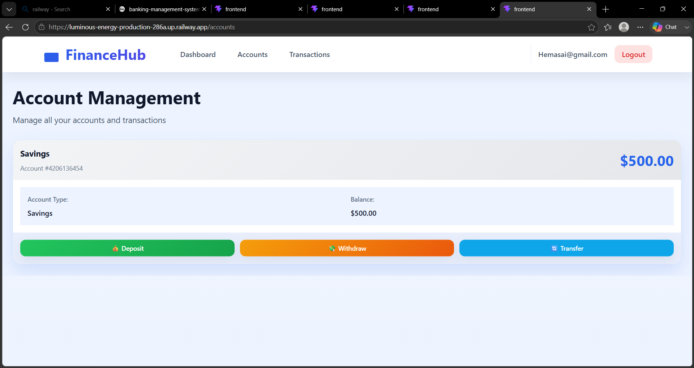
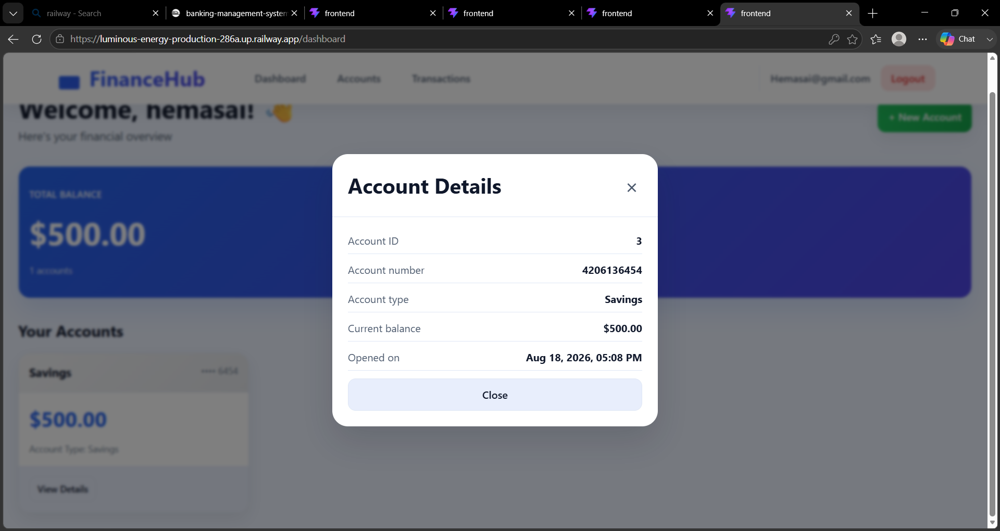
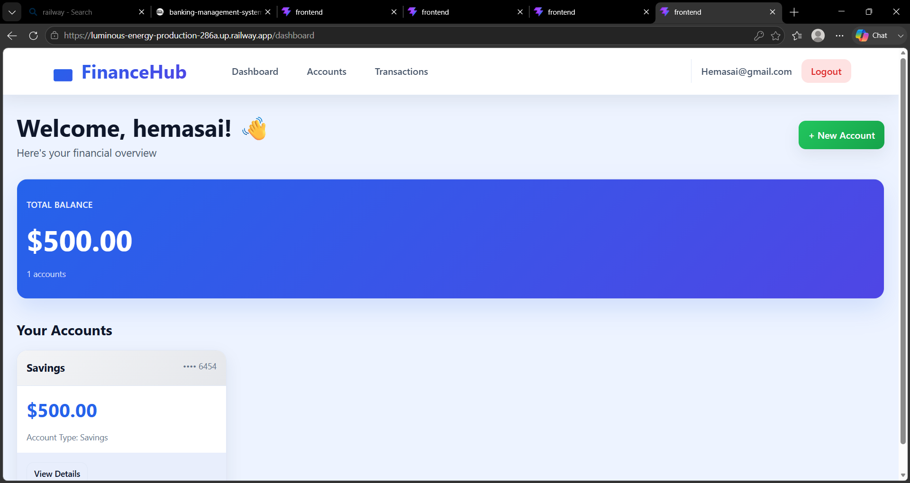
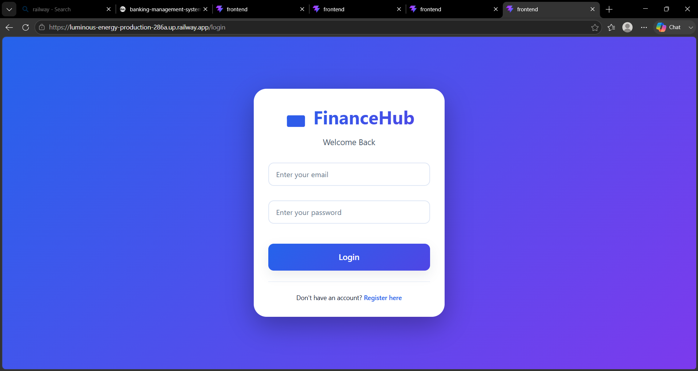

# 💳  Banking Management System

A full-stack banking management system with user authentication, account management, deposits, withdrawals, transfers, and transaction history.

## 🚀 Live Demo

**Banking Management System — Live Website**

https://luminous-energy-production-286a.up.railway.app

## ✨ Features

- User registration and login
- JWT-based authentication
- Create and manage bank accounts
- View account balances
- Deposit money
- Withdraw money
- Transfer money between accounts
- Transaction history
- Account details
- REST API
- Railway deployment

## 🛠️ Tech Stack

### Frontend
- React
- Vite
- JavaScript
- Axios
- React Router
- CSS

### Backend
- Python
- FastAPI
- SQLAlchemy
- JWT Authentication

### Database
- MySQL

### Deployment
- GitHub
- Railway

## 📸 Screenshots

### Login


### Dashboard


### Account Management


### Account Details


### Transfer Money


### Transaction History


## 📁 Project Structure

```text
Banking-Management-System/
├── backend/
│   ├── app/
│   │   ├── models/
│   │   ├── routes/
│   │   ├── schemas/
│   │   └── database/
│   ├── main.py
│   └── requirements.txt
├── frontend/
│   ├── src/
│   ├── public/
│   ├── package.json
│   └── vite.config.js
└── README.md
```

## 🔗 API Endpoints

### Authentication

```text
POST /auth/register
POST /auth/login
```

### Banking

```text
POST /bank/accounts
POST /bank/deposit
POST /bank/withdraw
POST /bank/transfer
```

Interactive API documentation:

https://luminous-energy-production-286a.up.railway.app/docs

## ▶️ Run Locally

### Backend

```bash
cd backend
python -m venv .venv
.venv\Scripts\activate
pip install -r requirements.txt
uvicorn main:app --reload
```

### Frontend

```bash
cd frontend
npm install
npm run dev
```

Frontend:

```text
http://localhost:5173
```

## ☁️ Deployment

The project is hosted on GitHub and deployed on Railway. Updates pushed to the connected `main` branch can trigger a new deployment.

## 👨‍💻 Author

**Vishnu**

GitHub: https://github.com/vishnu99660

## 📌 Disclaimer

This project is for educational and demonstration purposes. It is not intended to be used as a production banking platform without additional security, compliance, auditing, and financial controls.
